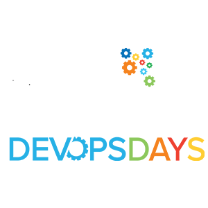

<!-- Main -->

<!-- One -->

    

    

    
    <h1 style="text-transform: uppercase;" class="text-gradient-sunset">DEVOPSDAYS TEL AVIV 2025</h1>
    <h2 style="text-transform: uppercase; color: #8d82c4;">December 11, 2025 at Expo Tel Aviv!</h2>



        

   <section id="keynote" class="glass" style="margin: 2em 0; padding: 3em 2em; text-align: center;">
  

    <header class="major">
      <h2 class="text-gradient-sunset">&#9733; Keynote Speaker &#9733;</h2>
    </header>

    

    <ul class="icons" style="justify-content: center; margin-bottom: 1em;">
      <li><a href="https://x.com/solomonstre" target="_blank" rel="noopener noreferrer"
             class="icon fa-twitter">Twitter</a></li>
      <li><a href="https://www.linkedin.com/in/solomonhykes/" target="_blank" rel="noopener noreferrer"
             class="icon fa-linkedin">LinkedIn</a></li>
      <li><a href="https://github.com/shykes" target="_blank" rel="noopener noreferrer"
             class="icon fa-github">GitHub</a></li>
    </ul>

    <h3>Solomon Hykes</h3>
    
Creator of <strong>Docker</strong>, CEO &amp; Co-Founder of <strong>Dagger</strong>

    
We are thrilled to announce Solomon Hykes as the keynote speaker at
       <strong>DevOpsDays TLV 2025</strong>! 
       Tickets are on sale — register now and let's show him some TLV hospitality!

    <ul class="actions" style="justify-content: center;">
      <li>
        <a href="{{ site.hero.register_url | default: 'https://www.youtube.com/watch?v=huRfsLMK5sA&list=PL8tivQAdoavMttbcb875zvINwJOqAEYCD' }}"
           class="button next" target="_blank" rel="noopener noreferrer">
          Watch Videos
        </a>
      </li>
    </ul>

  

</section>

DevOpsDays Tel-Aviv is back for its ELEVENTH EVENT to celebrate our AWESOME TLVCOMMUNITY representing all topics from DevOps Tel Aviv to Cloud Native & OSS Day Tel Aviv, Serverless TLV, and Statscraft.

            
DevOpsDays Tel Aviv is part of the global <a href="https://devopsdays.org/tel-aviv" target="_blank">devopsdays event series</a>, bringing in participants from the entire global devopsdays community.  To learn more, you can visit our event on the main <a href="https://devopsdays.org/" target="_blank">devopsdays.org</a> website.

            
Join leading industry speakers along with DevOps, SRE, platform, production and operations engineers for two full days of sessions focusing on best practices in modern  engineering - from the infrastructure and operations to the systems and processes.
    

    

    

 
     <h3 style="text-transform: uppercase; color: text-gradient-sunset; text-align: center;"> IT'S A WRAP ON DEVOPSDAYS TEL AVIV 2025! </h3>
      


<!-- 
    

   <h2 style="tex-transform: uppercase; color: #c0d44f;"> SPONSOR THE EVENT</h2>
         <ul class="actions"><li><a href="/sponsor" target="_blank" class="button fit"> CHECK OUT THE SPONSORSHIP OPPS</a></li></ul> 
    
 -->

<!--  -->

    

      

              

<!--  

 

            
<ul class="actions"><li><a href="/devopsdays/agenda-2021" class="button fit"> <i class="fa fa-cog" style="color: red;"></i>VIEW EVENT PROGRAM</a></li></ul>

            
<ul class="actions"><li><a href="/devopsdays-quicklinks" class="button fit"> <i class="fa fa-cog" style="color: #c0d44f;"></i> EVENT QUICK LINKS</a></li></ul>
-->

  
	
