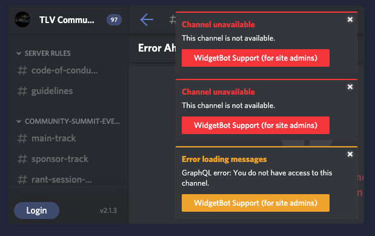
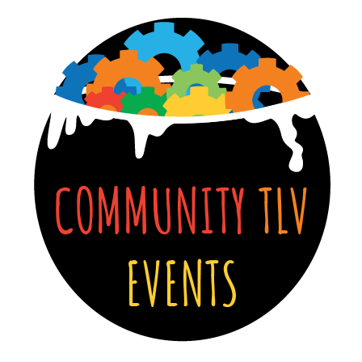

<!-- <iframe src="https://docs.google.com/presentation/d/e/2PACX-1vTAFFgTMU6uAbKnjEIzNQbFSG5bFokdC5_J3cadvCrLp8tozcUTDEBJTcvsXv1-gy5uhiBc_bnSLf__/embed?start=true&loop=true&delayms=15000&rm=minimal"  frameborder="0" width="1440" height="100"></iframe> -->

 
 

<!-- One -->

     

                    <h4> Watch our Live Events</h4> 
                    

                        
<iframe src="https://www.youtube.com/embed/9faC5XqDftc" frameborder="0" allow="accelerometer; autoplay; clipboard-write; encrypted-media; gyroscope; picture-in-picture" allowfullscreen style="position: absolute; top: 0; left: 0; width: 100%; height: 100%;"></iframe>

                           <!-- 
<h5 style="text-align: center; text-transform: uppercase;"><i class="fa fa-calendar"></i> Find the full agenda <a href="/agenda.html" target="_blank"> here</a>.</h5>
 -->
                    

                

   	

    

        <h2 id="discord">Discord Server - LIVE CHAT</h2>

    <widgetbot server="744871304594849822" channel="783642230790553631" style="position: absolute; top: 0; left: 0; width: 100%; height: 100%;"></widgetbot>
    
    

<strong>WHAT DO I DO NOW THAT I'M IN?</strong>

       <ul>
       <li>You are welcome to ask questions about talks & interact with the speakers - you can drop your Q&A in the Live Event Channel.</li>
       <li>You can interact with other community members based on topic - there is a channel for each community, you can introduce yourselves at the watercooler, and you are more than encouraged to visit the <strong>additional channels</strong> where you can find community announcements, employment opportunities, and more.</li>      
     

       </ul>

        

<strong>TROUBLESHOOTING</strong>

        If you are seeing a yellow or red error in the box, you need to click on the "Login" button at the bottom left - and authorize "Widgetbot" and then you will be able to use the chat from within the website.
        <ul>       
        <li>If you are still seeing yourself as "UNVERIFIED" and are unable to access any channels that is because you have not accepted the Code of Conduct in the #code-of-conduct channel.  Once you do so, you will receive your "Member" role, and will be able to participate in server chats.</li>      
        </ul>

  

   <!-- <iframe src="https://discordapp.com/widget?id=744871304594849822&theme=dark" width="75%" height="500" allowtransparency="true" frameborder="0" sandbox="allow-popups allow-popups-to-escape-sandbox allow-same-origin allow-scripts"></iframe> -->

    

    

  

    

        <h2 style="text-transform: uppercase;">Register to Join Us</h2>
            <ul class="actions">
                <li><a href="http://bit.ly/tlv-community-may-meetup" target="_blank" class="button next">RSVP</a></li></ul>
    

  

    
     
    <h3><i class="fa fa-film"></i> Previous Events </h3>
    

  

  

<strong>APRIL MEETUP - Kubernetes, Microservices, Production, Scale with Aerospike & Playtika</strong>

 
 

<strong>MARCH MEETUP - Community Blitz Q1</strong>

 

 

 

<!-- End Test -->
    
   
<!-- 

	

    

        <h2 id="discord">Discord Server - LIVE CHAT</h2>

    <widgetbot server="744871304594849822" channel="744871304594849825" width="800" height="600"></widgetbot>

       <!-- <iframe src="https://discordapp.com/widget?id=744871304594849822&theme=dark" width="75%" height="500" allowtransparency="true" frameborder="0" sandbox="allow-popups allow-popups-to-escape-sandbox allow-same-origin allow-scripts"></iframe> -->

   <!-- 

    
 
 
-->

    
 
        
<a href="#discord" id="#discord"><h3>Getting Started with Discord</h3></a>

        
We recommend you join our Discord server to connect with friends from the community, and to receive updates from the event organizers.

            <ul>
            <li>Join Discord <strong><a href="https://discord.gg/fV4cMKQ" target="_blank">HERE</a>.</strong></li>
            <li>It is recommended to use the desktop or mobile app.</li>
            <li>Once you have joined the server, you will be required to accept the Community Guidelines and Code of Conduct to be able to have access to the rest of the channels. Once you do so, the channels and participation in the community will be available to you. </li>
            </ul>
        
<strong>Looking forward to chatting with you there!</strong>

         
    

    
	

